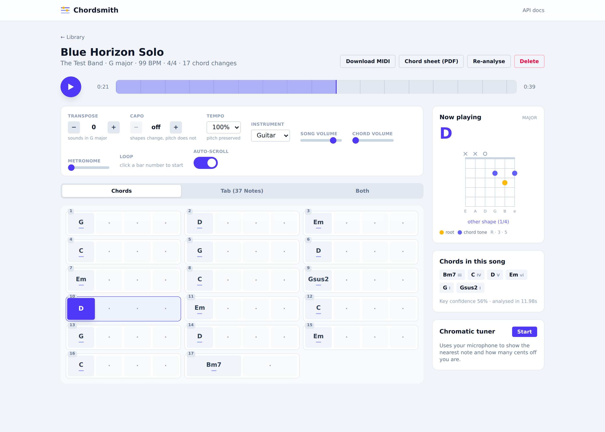
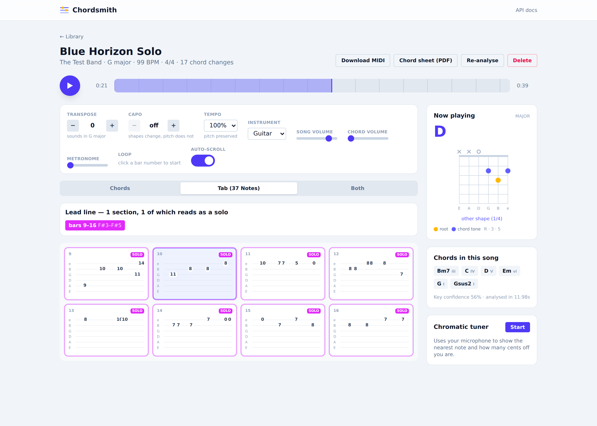

# Chordsmith

Turns audio files you own into chords you can play along with — and, going past
what Chordify does, transcribes the lead line as guitar tablature and flags the
sections that read as solos.

Upload a track; the analyser finds the beats, the downbeats, the key and the
chords, transcribes the melody, and the player scrolls all of it in time with
the music.




## What it does

**Chord chart**
- Beat and downbeat detection, tempo and meter (4/4 or 3/4)
- Key estimation, and chord recognition over a 13-quality vocabulary
  (major, minor, 7, m7, maj7, sus2, sus4, 6, m6, dim, aug, m7b5, dim7)
- A beat-aligned grid that highlights the current beat and scrolls itself

**Lead line and tablature** — the part Chordify has no equivalent for
- Monophonic transcription of the dominant melodic voice
- Notes laid out on the fretboard by shortest path over hand movement, so the
  tab stays in position instead of jumping around the neck
- Bars carrying a lead line grouped into sections; dense, wide-ranging ones are
  flagged as solos and are clickable to jump straight to them

**Practice tools**
- Transpose (±11 semitones) and capo, which changes the shapes without changing
  the pitch
- Tempo from 50% to 125% with the pitch preserved
- Loop any range of bars — click a bar number, shift-click another
- Chord diagrams for guitar and ukulele, plus a piano keyboard view
- A synthesised chord track and a metronome, each with its own volume, so you
  can fade the recording out and the chords in
- A chromatic tuner driven by the microphone
- MIDI export and a printable chord sheet (print to PDF)

## Running it

### With Docker

```sh
git clone -b claude/chordfy-clone-v79xr7 https://github.com/OllekramXBR/teste.git
cd teste/chordsmith
docker build -t chordsmith .
docker run -p 8000:8000 -v chordsmith-data:/data chordsmith
```

Then open <http://localhost:8000>.

For Unraid, Tailscale, and the deployment details, see **[DEPLOY.md](DEPLOY.md)**.

### From source

Two processes in development — the API, and Vite with hot reload:

All paths below are relative to this directory (`chordsmith/` inside the repo).

```sh
# API
cd backend
python3 -m venv .venv
.venv/bin/pip install -r requirements.txt
.venv/bin/uvicorn app.main:app --reload --port 8000

# UI
cd frontend
npm install
npm run dev          # http://localhost:5173, proxying /api to port 8000
```

Building the frontend (`npm run build`) makes the API serve the UI itself, so
production is a single process on port 8000.

### Tests

```sh
cd backend && .venv/bin/python -m pytest        # 64 tests
cd frontend && npm run typecheck
```

The analysis tests run the real pipeline against a synthetic track whose chord
progression, tempo and melody are known, so they check accuracy rather than just
that the code runs.

## How the analysis works

```
audio ──► harmonic/percussive split
            │
            ├─ percussive ──► onset envelope ──► beat tracking ──► tempo, beats
            │                                          │
            │                                          ▼
            └─ harmonic ──┬─ CQT chroma ──► beat-sync ──► chord HMM ──► chords
                          │      └─ bass chroma ──► root disambiguation
                          │
                          └─ high-pass ──► pYIN ──► note segmentation ──► tab
```

**Chords.** Chroma is aggregated per beat (median, so one percussive frame
cannot colour a whole beat) and matched against weighted templates for every
chord in the vocabulary. A first-order HMM then decodes the sequence: any chord
may follow any other, but staying put is rewarded, which is what turns a noisy
frame-wise guess into a stable chart. Key is estimated first
(Krumhansl-Schmuckler) and fed back as a mild bonus for diatonic chords, and a
separate bass-register chroma resolves roots that the full-range chroma loses
among the upper partials.

**Downbeats.** Two cues, combined: percussive accent (downbeats are usually the
loudest beat of the bar) and harmonic rhythm (chord changes overwhelmingly land
on downbeats). Every meter and phase is scored on the contrast between the beats
it would call downbeats and the ones it would not.

**Lead line.** pYIN tracks pitch, but only after a high-pass filter — the
strongest fundamental in a full mix is the bass, not the melody, and without the
filter the transcription follows the bass line. Notes are split on pitch changes
*and* onsets together, because pitch alone cannot separate two of the same note
played in a row. Isolated octave jumps are pulled back in line with their
neighbours.

**Tablature.** Each note has several possible positions; picking them is a
shortest-path problem where the cost is what the hand actually has to do.
Movement within a hand span is nearly free, going beyond it is expensive, and
crossing strings barely costs anything — which is why a scale comes out laid
across the strings instead of run up a single one.

**Chord diagrams** are searched rather than looked up: for every position on the
neck, the code enumerates what each string could play and scores the results on
playability. Shapes needing a barre across a string the voicing wants open are
rejected as unplayable. This reproduces the standard shapes (G `320003`, C
`x32010`, D `xx0232`, F `133211`) without a fingering table to maintain, and
covers every chord in every key.

## What it cannot do

Worth being straight about:

- **No YouTube.** Chordify has a licensing arrangement; extracting audio from
  YouTube would breach their terms. This works on files you already have — or,
  when the library search comes up empty, on a track you choose to pull from
  mp3.pm, which is then imported like any upload.
- **No source separation.** Lead transcription follows the loudest melodic
  voice. On a clean guitar or vocal line it is accurate; in a dense mix it will
  follow whichever voice dominates, and tracks that are all rhythm parts come
  back with no lead at all.
- **Solo detection is a heuristic**, not a classifier. A section is called a solo
  when it is dense and wide-ranging enough to read as one — a busy sung melody
  can trip it, and a slow, sparse solo will be reported as a lead line instead.
- **Chord vocabulary stops at 13 qualities.** No slash chords, no 9ths or 11ths.
  Adding them would cost accuracy on the chords that actually matter.
- **No AAC/M4A.** Decoding runs through libsndfile, which handles MP3, WAV,
  FLAC, OGG and AIFF without ffmpeg. Convert anything else first.
- **No accounts or authentication.** Anyone who can reach the server can see and
  delete the whole library — which is why the deployment guide puts it behind
  Tailscale rather than on the open internet.

## Performance

Roughly 5–10 seconds of analysis per minute of audio; pYIN dominates. The first
analysis after a process start is much slower because numba compiles its
kernels, so the server warms them up on startup. Uploads return immediately and
analysis runs on a small thread pool, with the frontend polling for the result.

## API

Interactive docs at `/docs`.

| Method | Path | Purpose |
| --- | --- | --- |
| `GET` | `/api/health` | Status, library size, limits |
| `GET` | `/api/songs` | Library, with `search`, `limit`, `offset` |
| `POST` | `/api/songs` | Upload; returns immediately, analysis runs in the background |
| `GET` | `/api/songs/{id}` | Song plus its full analysis |
| `DELETE` | `/api/songs/{id}` | Delete the song and its audio |
| `POST` | `/api/songs/{id}/reanalyze` | Re-run the analysis |
| `GET` | `/api/songs/{id}/audio` | Stream the audio; supports range requests |
| `GET` | `/api/songs/{id}/midi?transpose=` | Chord chart as a MIDI file |
| `GET` | `/api/theory/vocabulary` | Every chord the analyser can emit |
| `GET` | `/api/theory/transpose` | Transpose labels, optionally re-shaped for a capo |
| `GET` | `/api/mp3pm/search` | Search mp3.pm for a track the server library does not have |
| `POST` | `/api/mp3pm/import` | Download a searched track into `/data/music`, then analyse it |

## Configuration

| Variable | Default | Purpose |
| --- | --- | --- |
| `CHORDSMITH_DATA_DIR` | `backend/data` | Audio files and the SQLite database |
| `CHORDSMITH_MUSIC_DIR` | `<data>/music` | Where tracks downloaded from mp3.pm land |
| `CHORDSMITH_MAX_UPLOAD_MB` | `60` | Upload size limit |
| `CHORDSMITH_ANALYSIS_WORKERS` | `2` | Concurrent analyses |
| `CHORDSMITH_CORS_ORIGINS` | `localhost:5173` | Extra allowed origins |
| `PUID` / `PGID` | `99` / `100` | Ownership of files written to the data volume |

## Layout

```
backend/
  app/
    analysis/     theory, beats, chords, melody, tab, pipeline
    routes/       songs and theory endpoints
    main.py       app, CORS, static hosting of the built frontend
    jobs.py       background analysis queue and JIT warm-up
    storage.py    SQLite persistence
    midi.py       dependency-free Standard MIDI File writer
  tests/          64 tests, including end-to-end accuracy checks
frontend/
  src/
    lib/          theory, fretboard search, API client, Web Audio engine
    components/   chord grid, tab staff, diagrams, toolbar, transport, tuner
    pages/        library and song views
docker/           entrypoint, Tailscale serve config, Unraid template
```

## Built with

[librosa](https://librosa.org) for the signal processing, FastAPI for the API,
React with Vite and Tailwind for the interface. No machine-learning models are
downloaded or run — everything here is classical MIR plus the pYIN and beat
trackers librosa ships.
